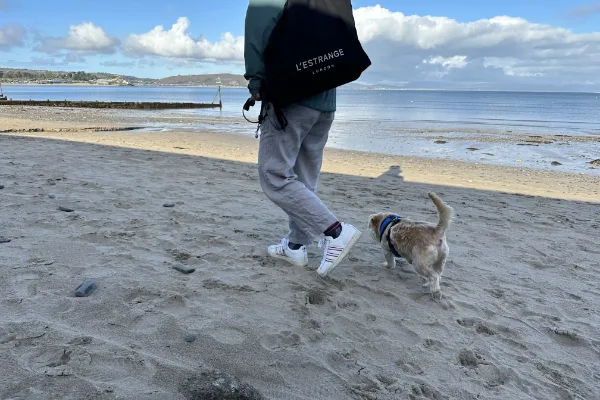
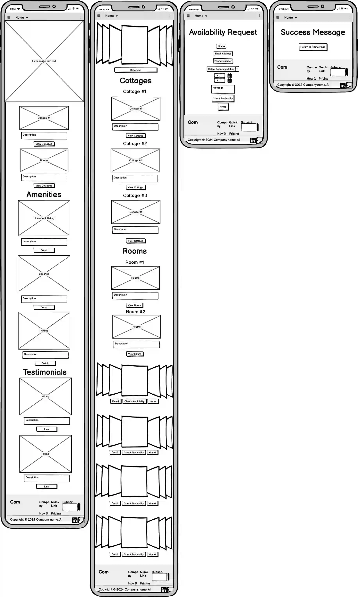
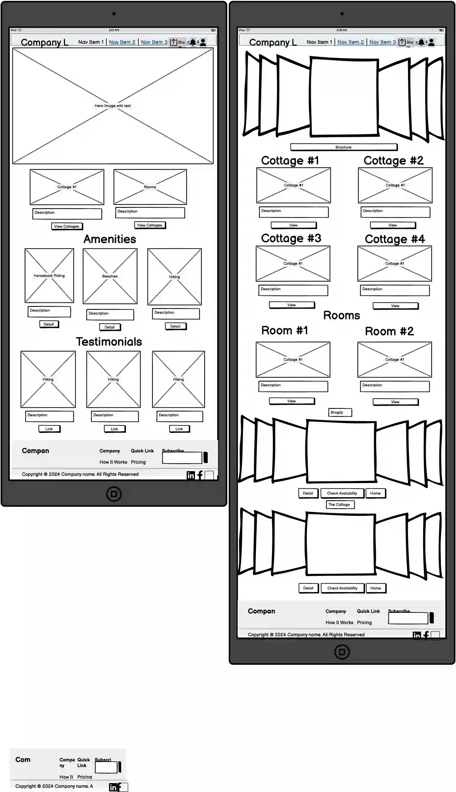
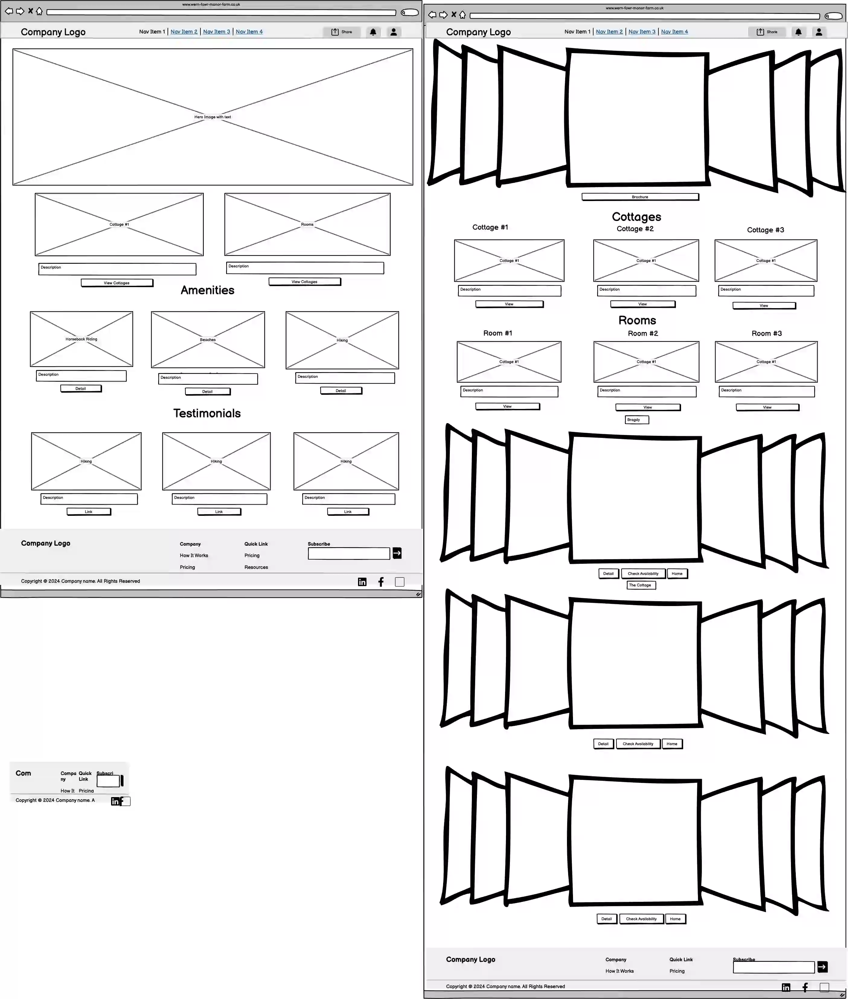

# Explore what North Wales has to Offer

# Aim of the site

---

This site will introduce visitors to a beautiful 75 acre manor farm B&B in North Wales. The client has requested an update of their 25 year-old site to cater to modern user preferences. This site will display the attractive rental options at the farm, as well as the ameneties on and near the property. It will employ responsive front-end design with Bootstrap and custom CSS and HTML and modern layout techniques. The site will simplify the booking process, flow from a button below the hero image atop the home page. Alternatively visitors can click links to specific properties from the accommodations section and click a booking button below the carousel images for individual properties.

Much of the existing client base come from repeat customers. But the site will better attract new business from prospective clients who find the business through google or referals from past customers, local businesses, and the local community.

The client have offered the following guidance for the new site.

1. A simple design that responds dynamically to any screen size.
2. A professional looking colour palette.
3. Site design that will appeal to the repeat clientele who know what they want as well as the one-off weekenders who may have never visited the area.
4. Feature that they are a dog friendly business.
5. Streamline the booking process to one button on nav bar and buttons on each property's gallery.
6. Show both the amenities on the property as well as those nearby.
7. Crop the logo, link to homepage, and place it on the nav bar.
8. De-clutter the nav bar, header and footer.
9. Source images from past customers via Trip Advisor and Google and reformat all the images for responsiveness.

---

## UX:

The company is well established so their main goal is to update the site with modern website design to better meet the modern user's methods to view the site across many different screen sizes. However new customers typically fall within the following categories:

1. Typical client is from the West Midlands, Scotland and Wales
2. They may have friends in the local retirement community.
3. Weekender's and dog owner(s).
4. Visitors to the nearby town of Abersoch and the Warren Spa

To help modernize the site we will

* Replace text walls and associated inconsistent quality and size images with a balance of text and consistently sized responsive images.
* Smooth site navigation to improve user experience.
* Remind existing clients why they love both the farm and the area with pictures.

---

## Client Stories

"As a visitor to the site I want to see a visual representation of what I love about the property and area."

"As a visitor to the site I want to ensure I feel confident that I will be satisfied with my stay."

"As a visitor to the site I want to be able to easily find available dates to book."

"As a vistor The site needs to confirm my booking has been processed."

---

## Wireframe Mockups

During the design process I drew up the following wireframes using Balsamiq.

## Phone Size

## Tablet Size

## Desktop Size

---

## Home Page Features

### Hero Image with Text

A beautiful image showing the manor house with inviting attractively styled text message.

### Accommodation

Two clickable cards containing a hero image and descriptive text of the two types of accommodation on the property (Cottages & Rooms). Clicking the cards takes visitors to a new page with more/larger images of the selected property category and a view button.

### Amenities

A series of clickable cards containing a hero image and a basic description of the amenities. Clicking the button takes visitors to a new page with a brochure.

### Accommodation Page

Header: A carousel of inviting images and a button for the brochure below it.

Section 1: Cottages are detailed in cards with a button to a gallery for each cottage.

Section 2: B&B rooms are detailed in cards with a button to a gallery for each room.

Section 3: Cottages and rooms are detailed in carousels with a button to check availability for each property as well as a home button.

### Booking Form

Navigated to from the nav bar or the property galleries. Visitors enter name, email and phone numbers to start. The date range of the visit is entered and accommodation option is selected. Visitors can enter a message. Once the booking is submitted a success page is triggered.

### Success Page

Once a booking is submitted it triggers a success message page. The success page thanks the visitor and offers a button to return to the home page.

### Contact Us

The footer contains contact details and social media links.

---

## Future Goals

* The client would like the site to accept payments online.
* The client would like the booking form to interact with scheduling database with user input.
* The client would like the booking page to display available dates and prices in the calendar below the date range selector.
* The client would like to add drone video.

---

## Technology Used

* [Bootstrap](https://getbootstrap.com/) - For responsive sizing.
* [Font Awesome](https://fontawesome.com/) - For logos
* [VSCode](https://code.visualstudio.com/) - Editor for local coding.
* [GIT](https://git-scm.com/) - Version control
* [GitHub](https://github.com/) - to  host the repository remotely and deploy the site via pages.

---

## Testing

W3 Validation of html flagged a number of errors.

- Duplicate tags and ID's were deleted.
- Unclosed divs were closed.
- Duplicate divs were deleted.
- Unnecessary elements (p, strong) were deleted.
- many unnecessary trailing slashes were deleted.

W3 Validation of css flagged one error.

- Too many values in .card-img-top for 'center/cover'. Deleted center value.

Lighthouse scored 73 on performance

- Flagged image file sizes, contentful paint as main issues. Resized all images to widest dimension of 600px. Fter reformatting and deleting unecessary images the performance score improved to 91.

Wave flagged errors for no text on social media links (disregarded).

### Issues and resolutions

- Images were mixed pixel aspects and file sizes were too big. Many images were too dark to communicate a pleasing representation of the property. File names did not conform to MVP requirement.

Resolved by sourcing new images from Trip Advisor and Google as well as the existing site. Selected best images and renamed the files. Reformatted selected images to webp at a resolution that would not pixelate on the site. Then resized all images to a widest dimension of 600px.

- Logo needed updating to conform to modern design styles. New logo needed to be formatted to overlay on images.

Resolved by creating a new logo with alpha channel using Pixelmator Pro.

- CSS validator error:too many values. 

.card-img-top {
    height: 100%;
    object-fit: center/cover;
}

resolved by removing center value.

- single card row did not center correctly on Accommodation page.

Resolved by searching W3 for proper syntax for offset.

### Known Issues

- duplicate links to brochure for detail buttons on amenities cards and accommodation galleries to reduce scope.
- booking form is not checking actual availability due to scope of that feature.
- testimonial links navigate to google and trip advisor pages for the farm and not specific reviews.

---

## Deployment

In order to deploy the [repository](https://jordalenko.github.io/Wern-Fawr-B-B/) from GitHub Pages I performed the following steps.

1. Select **settings** from the GitHub repository.
2. Scroll down to **pages**.
3. Select the **main branch** in **Builds and Deployment** and save.
4. The deployed page link can be found on the sidebar of **GitHub Pages**.

---

## Credits

Most of the site (nav bar, footer, carousels, cards and form) was sourced from bootstrap's website.

The date picker was sourced from https://bootstrap-datepicker.readthedocs.io/en/latest/markup.html .

I created the success page image with Pixelmator Pro software.

Logo:

Logo provided by owners and cropped with Pixelmator Pro software.

Photography:

Photos with 'ja' in the name were taken by Jordan Acomba.
Photos with 'ta' in the name were taken by various authors of Trip Advisor reviews.

### Content

Image Sources:

Images were primarily sourced from the existing site. If an image was not sourced from the existing site it will have a two letter code identifying the source.

ja - Sourced from Jordan Acomba's photo library.
ta - Sourced from Trip Advisor photos.

I created the logo and thank you image.

### Acknowledgements

I would like to thank both my mentor, Spencer Barribal and the members of my study group, Robert Jonah Lewis, Steve Powell and Axe de Klerk for their invaluable support and feedback.