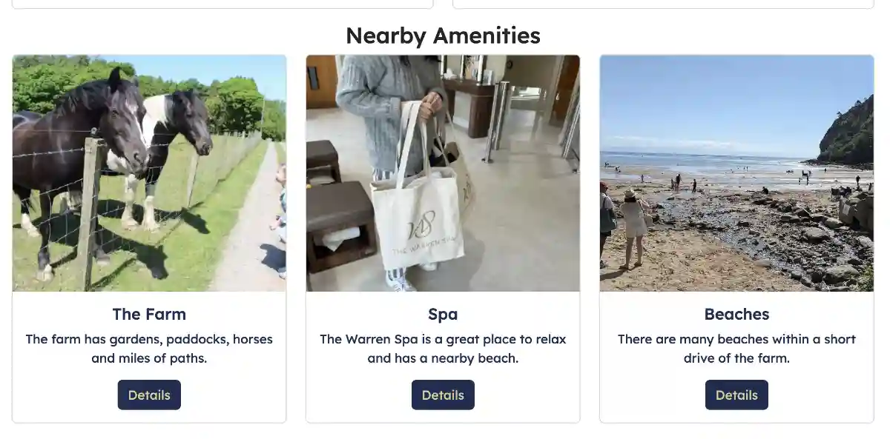

# Explore what North Wales has to Offer

### [View Live Site Here](https://jordalenko.github.io/Wern-Fawr-B-B/)

# Aim of the site

This site's 5 pages will introduce visitors to a beautiful 75 acre manor farm B&B in North Wales. The site presents the attractive rental options and nearby amenities in an easily navigable layout. It employs responsive front-end design using Bootstrap and custom CSS and HTML and modern layout techniques.

## Responsive

## User Experience (UX):

### User Stories

#### About The Company

The company is well established so their main goal is to update the site with modern website design to better meet the modern user's methods to view the site across many different screen sizes. However new customers typically fall within the following categories:

1. Typical client is from the West Midlands, Scotland and Wales
2. They may have friends in the local retirement community.
3. Weekender's and dog owner(s).
4. Visitors to the nearby town of Abersoch and the Warren Spa

#### Client Stories

- "As a returning visitor to the site I want to see a visual representation of what I love about the property and area."

- "As a new visitor to the site I want to ensure I feel confident that I will be satisfied with my stay."

- "As a visitor to the site I want a navigable site layout."

- "As a vistor the site needs to confirm my booking has been processed."

### Features

#### Main Page

* This page is first presented as the user visits the site beginning with the header and hero image which includes a welcome message/call to action.
* Following the hero image is the Accommodation section with buttons linking to those sections in the Accommodtions page.
* Following the accommodations section is the amenities section with pictures and buttons linking to the nearby amenities.
* Following the amenities section is the testimonials section with pictures and buttons linking to the user stories.
* The footer ends the main page. This is where the contact info and associated links exist.

Header

* The Header is featured at the top of the page.
* Shows the logo ”Wern Fawr” in company colours in the left corner.
* The right part contains the navigation.

Navigation

* The navigation is positioned on the right-hand side of the header area.
* When on smaller devices the navigation links collapse into a hamburger menu.
* One button included: Jump to the booking form.

Accommodations

* Two clickable cards containing a hero image and descriptive text of the two types of accommodation on the property (Cottages & Rooms). Clicking the cards takes visitors to a new page with more/larger images of the selected property category and a view button.

Amenities

* A series of clickable cards containing a hero image and a basic description of the amenities. Clicking the button takes visitors to a new page with a brochure.

Testimonials

* A series of clickable cards containing a hero image and a basic description of the testimonials. Clicking the button takes visitors to a new page with a review of the property.

### Accommodations Page

* This page begins with a carousel of hero images below the header, repeated from the main page.
* Following the hero carousel section is the cottages section with pictures and buttons linking to the cards for each cottage.
* Following the cottages section is the rooms section with pictures and buttons linking to the cards for each room.
* Following the rooms section are the cards with pictures of each room or cottage and buttons linking to the booking form, a details pdf and home.
* A repeat of the footer ends the accommodations page. This is where the contact info and associated links exist.

#### Booking Page

* This page begins with the header, repeated from the main page.
* Following the header is the booking form.
* A repeat of the footer ends the booking page. This is where the contact info and associated links exist.

Booking Form

Navigated to from the nav bar or the property galleries. Visitors enter name, email and phone numbers to start. The date range of the visit is entered and accommodation option is selected. Visitors can enter a message. Once the booking is submitted a success page is triggered.

#### Success Page

* This page begins with the header, repeated from the main page.
* Following the header is the success message with a button to return home.
* A repeat of the footer ends the success page. This is where the contact info and associated links exist.

Success Message

* Once a booking is submitted it triggers a success message page. The success page thanks the visitor and offers a button to return to the home page.

## Wireframe Mockups

During the design process I drew up the following wireframes using Balsamiq.

## Phone Size

## Tablet Size

## Desktop Size

## Features Left to Implement

* The client would like the site to accept payments online.
* The client would like the booking form to interact with a scheduling database based on user input.
* The client would like the booking page to display available dates and prices in the calendar below the date range selector.
* The client would like to add drone video and hi-res photographs of the property and accommodations.

## Design

Colours

* I have used a mixture of dark blue #1d2d52 and carmel #e4ce9f as the main colour theme for this site.
* All page sections have a background colour of white to make the text stand out and easy to read.

## Technology Used

* [Bootstrap](https://getbootstrap.com/) - For responsive sizing.
* Google Fonts: To import font family ’Lexend’ into the style.css file which is used primarily in the website. Added fallback font sans-serif. A secondary font family ’Indie Flower’ is used occasionally.
* [Font Awesome](https://fontawesome.com/) - For logos
* [VSCode](https://code.visualstudio.com/) - Editor for local coding.
* [GIT](https://git-scm.com/) - Version control
* [GitHub](https://github.com/) - to  host the repository remotely and deploy the site via pages.

### Testing

#### Browser testing

* I have tested that this page works using macOS (Macbook Pro) and Windows (Dell Laptop).
* I have tested that this page works in the following browsers using macOS: Chrome, Safari and Firefox and Windows: Chrome. 
* I have tested this page works on iOS devices using Safari browser (iPhone 14).

#### Responsivness

* Chrome developer tool have been used to check the responsivness.
* I have tested that this page works on different screen sizes from iPhone 5 (240px wide) and very large screens (5120 x 2880 px).

#### Validator Testing

W3 Validation of html flagged a number of errors.

- Duplicate tags and ID's were deleted.
- Unclosed divs were closed.
- Duplicate divs were deleted.
- Unnecessary elements (p, strong) were deleted.
- many unnecessary trailing slashes were deleted.

W3 Validation of css flagged no errors.

- Too many values in .card-img-top for 'center/cover'. Deleted center value.

Lighthouse scored 97 on performance

Wave flagged errors for no text on social media links (disregarded).

#### Functionality

Further Testing

* I have tested that the hover effect on all buttons and links works as expected.
* I have tested that all carousels work correctly.
* I have tested that all Font Awesome icons are displayed correctly.

Solved bugs

* I am not aware of any bugs

### Issues and resolutions

Develop more

- Images were mixed pixel aspects and file sizes were too big. Many images were too dark to communicate a pleasing representation of the property. File names did not conform to MVP requirement.

Resolved by sourcing new images from Trip Advisor and Google as well as the existing site. Selected best images and renamed the files. Reformatted selected images to webp at a resolution that would not pixelate on the site. Then resized all images to a widest dimension of 600px.

- Logo needed updating to conform to modern design styles. New logo needed to be formatted to overlay on images.

Resolved by creating a new logo with alpha channel using Pixelmator Pro.

- CSS validator error:too many values. 

.card-img-top {
    height: 100%;
    object-fit: center/cover;
}

resolved by removing center value.

- single card row did not center correctly on Accommodation page.

Resolved by searching W3 for proper syntax for offset.

### Known Issues

- Some images in the Cottages and Rooms carousels were somewhat pixellated. I had to work with these placeholders as they are all I could gather from the existing site. Consider them placeholders with a recommendation to client to revise.
- duplicate links to brochure for detail buttons on amenities cards and accommodation galleries to reduce scope.
- booking form is not checking actual availability due to scope of that feature.
- testimonial links navigate to google and trip advisor pages for the farm and not specific reviews.

## Deployment

In order to deploy the [repository](https://jordalenko.github.io/Wern-Fawr-B-B/) from GitHub Pages I performed the following steps.

1. Select **settings** from the GitHub repository.
2. Scroll down to **pages**.
3. Select the **main branch** in **Builds and Deployment** and save.
4. The deployed page link can be found on the sidebar of **GitHub Pages**.

## Credits

Most of the site (nav bar, footer, carousels, cards and form) was sourced from bootstrap's website.

The date picker was sourced from https://bootstrap-datepicker.readthedocs.io/en/latest/markup.html .

I created the success page image with Pixelmator Pro software.

Logo:

Logo provided by owners and cropped with Pixelmator Pro software.

Photography:

Photos with 'ja' in the name were taken by Jordan Acomba.
Photos with 'ta' in the name were taken by various authors of Trip Advisor reviews.

### Content

Image Sources:

Images were primarily sourced from the existing site. If an image was not sourced from the existing site it will have a two letter code identifying the source.

ja - Sourced from Jordan Acomba's photo library.
ta - Sourced from Trip Advisor photos.

I created the logo and thank you image.

### Acknowledgements

I would like to thank both my mentor, Spencer Barribal and the members of my study group, Robert Jonah Lewis, Steve Powell and Ax de Klerk for their invaluable support and feedback.